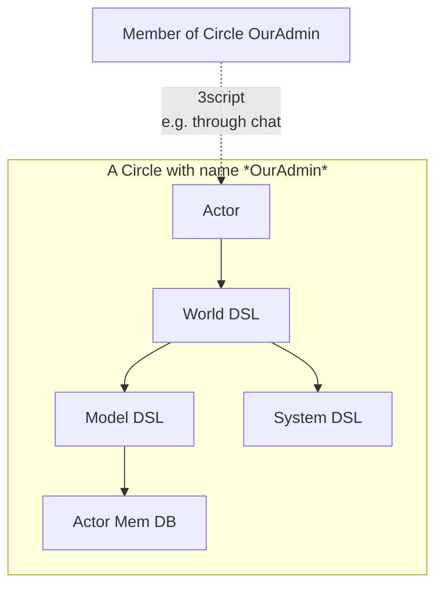
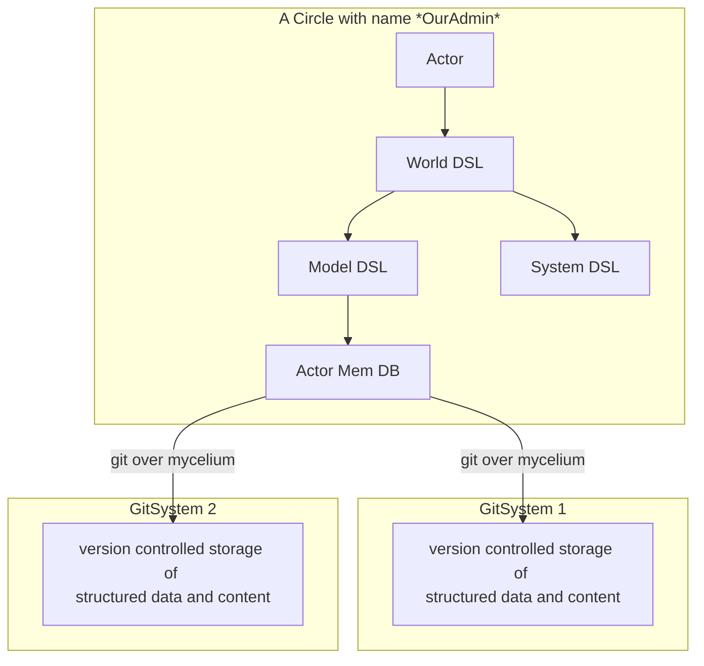
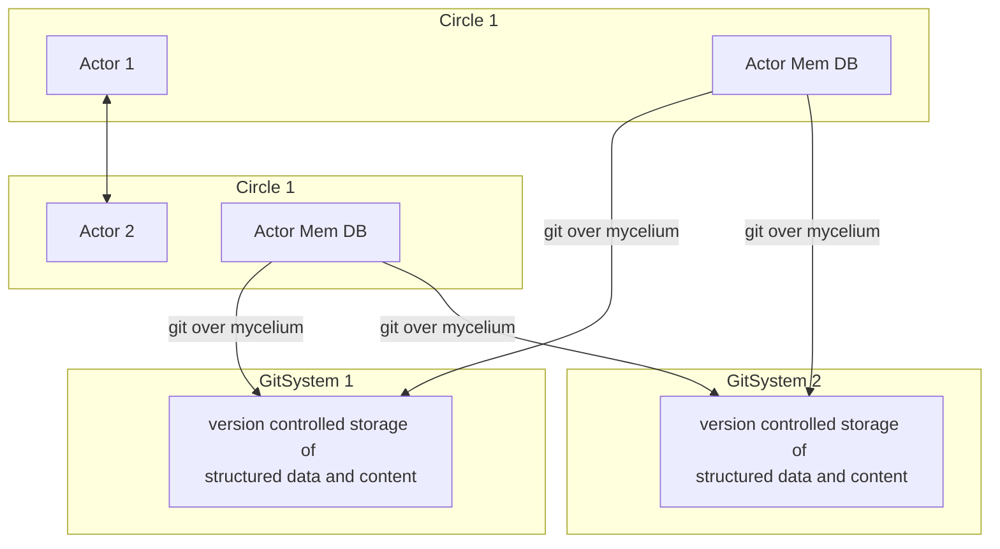

## Circle + Actor

A Circle has a main actor which will have recipe's calling world DLS based on context.

The World DSL abstracts access to model dsl as well as system dsl.

The user which is a member of the circle, communicate to the circle actor in this case using chat and 3script.

## Circle DB + Backend

All structured data is stored in actor memory db and version controlled optionally through quantum safe storage system or a git based system.

The redundant git stor at backend makes sure data data cannot be lost, multiple actors can work together, full version control is being achieved

Mycelium is our secure P2P network.

