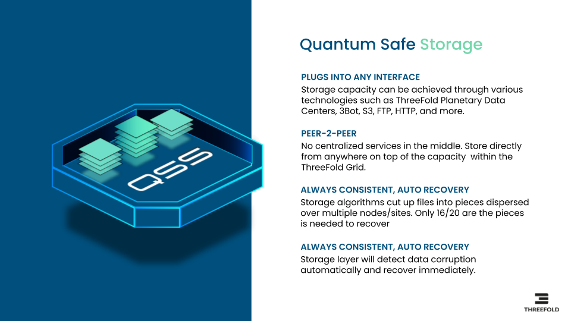

<h1>Quantum Safe Storage</h1>

## The Role of Quantum Safe Storage for AI

Imagine a storage system with the following benefits:

* up to 10x more efficient (power and usage of hardware) for certain workloads
* ultra reliable, data can not be lost
* ultra safe & private
* ultra scalable
* sovereign, data is close to you in the country of your choice
* true peer-to-peer, by everyone for everyone.
* not even a quantum computer can hack the storage

It is not a dream, it does already exist.

Our storage architecture follows a true distributed design. Participating nodes (can be on ultra safe locations) only store small incomplete parts of data (files, photos, movies, databases…) by only offering a slice of their current (local) storage devices. Managing the storage and retrieval of all these ‘distributed fragments’ is done by a software that creates ‘development and/or end-user interfaces’ for this storage algorithm. We call this ‘dispersed storage‘.

The user has complete control over where the data is stored and which level of redundancy which is required.

A storage system like this is very useful for an AI system, large datasets can be ingested or large language models loaded more quickly. We can even thin provision these language models to be even more efficient.

