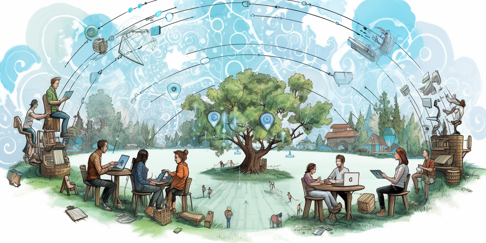
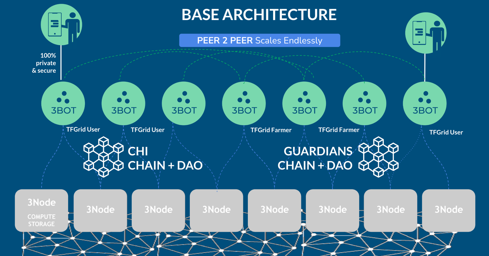

<h1> TFGrid 4.0 </h1>

<h2>Table of Contents</h2>

- [Introduction](#introduction)
- [Benefits](#benefits)
- [Simplicity and Decentralization](#simplicity-and-decentralization)
  - [P2P, Distributed and Super Scalable](#p2p-distributed-and-super-scalable)
- [Architecture](#architecture)
  - [3Bot for TFGrid Participant Functions](#3bot-for-tfgrid-participant-functions)
  - [3Bot for TFGrid farmer functions](#3bot-for-tfgrid-farmer-functions)
- [Simplifications](#simplifications)
  - [Billing](#billing)
- [TFGrid Guardians](#tfgrid-guardians)
- [2 Consensus Mechanisms](#2-consensus-mechanisms)
  - [Guardian Circles.](#guardian-circles)
  - [CHI Chain](#chi-chain)
***

## Introduction

Over the past few years, we've devoted a significant amount of energy and time to developing the current version of the ThreeFold Grid. We've achieved substantial deployment with an active community.

ThreeFold is working to its version 4.0 which is a super exciting new release we are working on

## Benefits

There are clear benefits to the ThreeFold Cloud enterprise.

- unlimited scalable
- regional internet concept (but much more flexible as what was prommised before)
- no longer dependency on TFChain (limits our scalability, billing and capacity tracking will no longer be done on TFChain)
- clear distinction between a money chain (e.g. stellar, ethereum, ...) and our own consensus mechanisms, our aim is to support any other blockchain
- introduction of mycelium, [more info](../../mycelium/mycelium.md).
    - net: unlimited scalable p2p planetary network which looks for shortest path and can reroute
    - pay: unlimited scalable p2p payment & billing framework
- introduction of 3bot: your digital twin helping you to deploy workloads, manage your farms, ...

**Our aim is to have a first version of TFGrid 4.0 available H1 2024 in beta mode. The idea is that the grid can run by itself without TFTech operational support.**

> See: Our [All Trust Foundational Concept for our TFGrid 4.0](alltrust.md)

## Simplicity and Decentralization

At ThreeFold Cloud, we consider that simplicity and decentralization is key to a resilient and efficient cloud and AI platform.

### P2P, Distributed and Super Scalable

Threefold Frid 4.0 will be 100% distributed and peer-to-peer.

## Architecture

Each participant (user and/or farmer) of the TFGrid will need  3Bot which can be hosted home or on any of the 3Nodes in the TFGrid. 

There are 2 blockchains who support the operation, one dealing with all money and identity matters, the others with the DAO’s and validation functionality of the TFGrid.

The 3Bots communicate on behalf of the users with the TFGrid or any of the blockchains.

### 3Bot for TFGrid Participant Functions  

* Your personal bot who helps you to deploy and manage your workloads (solutions) on top of the TFGrid. Your 3bot also helps you to buy and sell your threefold digital currencies.
* AI Chat Bot to deploy solutions and communicate with 3Bot (proof of concept)
    * Use artificial intelligence (like chat gpt but private) to talk with your 3bot
* Personal Chat server 
    * 3Script support, talk to your 3bot, configure and deploy solutions
    * Events will show up in your mail or chat client
* Accept payment requests.
    * For utilization of the grid, any services of the TFGrid can be automatically be paid for.
* Liquidity Support
    * sell buy digital currencies like TFT on your behalf
    * Sell/Buy TFT from Ethereum and Stellar
    * Integration with Kraken, BTCAlpha … exchanges (v4.1)
    * Atomic swaps to sell/buy TFT (v4.1)

### 3Bot for TFGrid farmer functions  

* Your personal bot who helps you to manage your farm and service offerings on top of the TFGrid.
* Farmer bot can do the power management of your farm (power node’s off and on)
* Your Farmer Bot will monitor and collect all relevant information from your 3Nodes 
* You can define your own pricing and your own solution offerings on top of the TFGrid.
* You don't have to run your own farmer bot but can be part of a farming cooperative.

> See: [All Trust Foundational Concept for our TFGrid 4.0](alltrust.md)

## Simplifications

Our aim is to simplify our TFGrid 4.0 as much as we can and focus on good documentation for the community to be able to contribute or manage the grid without TF Tech’s involvement.

Some examples of what we can simplify, we can remove billing on the chain and replace it with something else, or remove the generic DAO votes, but have them more specific, but so that it's easier for communities to manage their own internet.

### Billing

Billing will not be a native function of tfchain anymore. The idea is that farmers or solution providers can define their own pricing. Maybe there needs to be a minimum price if it's for raw capacity or a maximum. But in general, there will be much more flexibility for the farmer community and the solution providers to define their own pricing, they can build anything on top of the threefold grid. So it's much easier. For them to define the price they want to have for their own efforts. It will be up to the broader community, the users, to define if they want to pay the price as being asked for by the farmer or the solution provider.

## TFGrid Guardians

There will be multiple roles into threefold grid 4. 0. One very important role will be given to the Grid Guardians. Grid Guardians are people who need to be willing to spend hours per week in the beginning to deploy and maintain their guardian validators and operate the consensus mechanisms. They will be rewarded as such and become an important cornerstone of our decentralization effort.

A guardian will deploy a guardian validator to be part of a Guardian Circles, there need to be at least nine guardians per regional Internet. 

A standard validator has all the functions that you would expect from a blockchain and it will be quite easy for a validator to run these services. But some technical expertise will be required. 

A guardian validator is required to keep a grid up and running and safe e.g. the Guardian Validator will check the uptime of the 3Nodes, will do random checks to make sure that the 3Nodes are running our certified validated software, it will do certain other checks to do with billing or capacity checks and also store the results of those checks in a database. 

## 2 Consensus Mechanisms

### Guardian Circles. 

* 9-99 nodes, each Guardian runs one Guardian Circles Node.

Holding all the logic as needed to manage following functions

* Checking uptime. 
* Management of treasury on CHI Chain
* Keeping track of capacity used 
* keeping track of capacity deployed  
* Providing Proof of Payment (needed for the ZOS nodes to deploy a workload)
* Identity Verification
* Federation with other Guardian Circles (e.g. around identity and reputation)

All data is stored in a replicated database and secured by the Guardian Circle and can be replicated as many times as required by the community.

The Guardian Chain functions can be accessed over Open RPC.

Technology: tendermint successor + VLANG 3Bot runtime

### CHI Chain

Each regional Internet can chose to run on existing money blockchain or deploy an own Money chain.

If no CHI Chain deployed then more staking will be required per 3node 

Up to 99 nodes. Is a cosmos based delegated staking blockchain. The CHI Chain Validators earn money by deploying and maintaining a node. It's a straightforward deployment process. 

The functions of this blockchain 

* Digital Currency Functions (CHI and wrapped TFT in treasury).  
* Identities and Reputation. 
* Integration with other Public Blockchains through IBC protocol (see Cosmos ecosystem)
