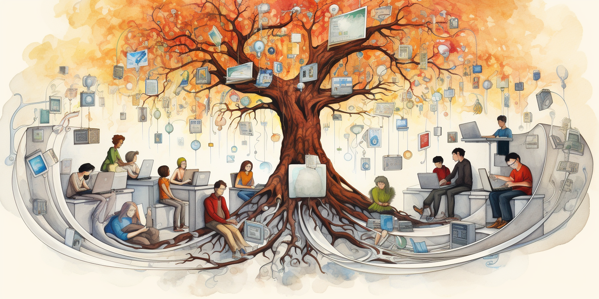

<h1> OurWorld Venture Creator </h1>

<h2> Table of Contents </h2>

- [Introduction](#introduction)
- [OurWorld Vision](#ourworld-vision)
  - [Our Modern Crisis](#our-modern-crisis)
  - [Guiding Principles for Change](#guiding-principles-for-change)
  - [Tools](#tools)

***

## Introduction

OurWorld is a venture creator based in Mauritius. The goal of OurWorld is to empower our startups to manifest the required solutions aligned with our vision. 

These startups have access to ThreeFold Technology as well as the full Mycelium ecosystem, a decentralized technology platform designed to enable conscious peer-to-peer collaboration. Mycelium provides the infrastructure for startups in the OurWorld ecosystem to develop transformative solutions, from finance to education. 

By combining funding, an ethical framework, and decentralized technologies, OurWorld aims to seed startups poised to make a positive societal impact. The versatile Mycelium platform allows this worldwide network of startups to exchange value and collectively upgrade how we cooperate.

## OurWorld Vision

OurWorld has a vision that is inspired by guiding principles and possesses the tools necessary to fix many issues of our current modern crisis.

### Our Modern Crisis

* Centralized AI and data platforms lack transparency and accountability. 
This raises concerns about manipulating users or limiting their agency.
* Erosion of privacy and bodily autonomy through invasive surveillance and social credit systems. This endangers freedom of choice and expression.
* Environmental degradation that threatens sustainability of natural systems humanity depends on.
* Proliferation of misinformation that polarizes society. This impedes reasoned discourse and collective problem-solving.

These interconnected crises endanger the future – yet also present an opportunity for transformation. Business as usual will not suffice. Fundamental upgrades are needed across society.

### Guiding Principles for Change 

The guiding principles for change of OurWorld always put the planet and people first.

* **Consciousness** - Cultivate self-awareness, ethics and wisdom within each person.
* **Compassion** - Practice understanding, service and sharing. Choose collaboration over division. 
* **Sustainability** - Incentivize regeneration. Safeguard ecosystems for future generations. 
* **Autonomy** - Honor rights to self-determination and sovereignty. Prevent authoritarian overreach.
* **Meritocracy** - Structure governance to draw on diverse expertise while limiting corrupt influence.
* **Abundance** - Innovate systems that create shared prosperity through new economic models. 

### Tools

* **Decentralization** Develop decentralized peer-to-peer networks for data, finance, communications, etc. This distributes power more equitably without centralized intermediaries.
* **Promote Education** that fosters critical thinking, self-awareness, and ethical values. This empowers individuals to make wise choices despite manipulative messaging.
* **Connect people** across divides to find common ground. This fosters societal cohesion and collective wisdom to address shared challenges.
* **Design economic models** that incentivize regeneration, compassion and creativity over self-interest. This creates abundance and reduces inequality.
* Champion **open collaboration** on solutions that benefit all of humanity and the planet. This unites us in shared purpose (opensource)
* **Support** individual and community rights to self-determination and bodily **sovereignty**. This prevents authoritarian overreach and protects freedoms.

Everyone has a role to play in this transformation. We must lift up humanity by elevating consciousness, enacting wise governance, developing ethical technologies, and coming together in good faith. The answers exist if we dare to dream widely and act boldly.

