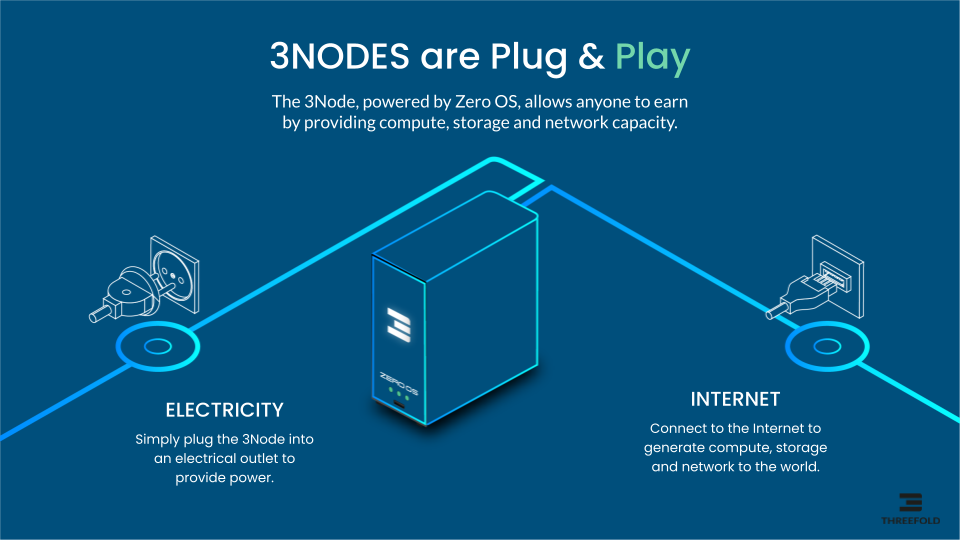
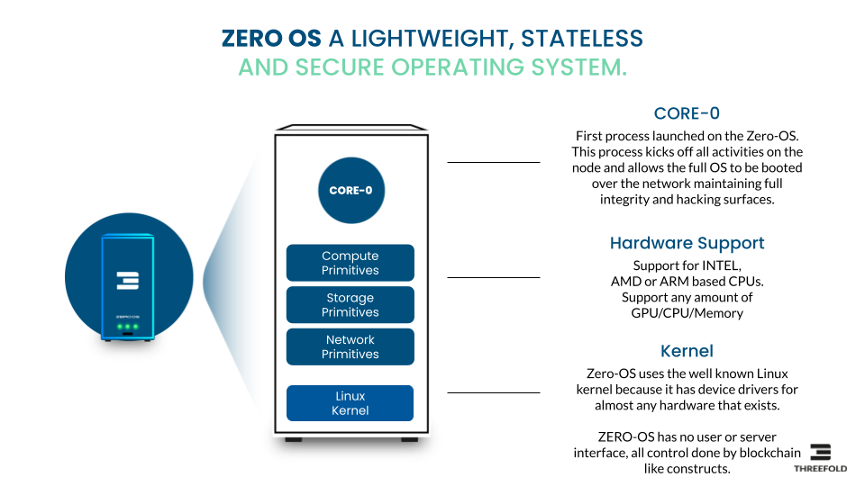

<h1> TFCloud Components</h1>

<h2>Table of Contents</h2>

- [Introduction](#introduction)
- [3Node and Zero-OS](#3node-and-zero-os)
- [AI Cloud](#ai-cloud)
- [3Bot](#3bot)
- [Autonomous \& Consensus Driven](#autonomous--consensus-driven)
  - [Autonomous Circle](#autonomous-circle)
  - [Human Chain](#human-chain)

***

## Introduction

Well-designed components make of TFCLoud a resilient and versatile solution for online storage. Here are some of them.

## 3Node and Zero-OS

Zero-OS is our uniquely designed stateless Operating System which is efficient and optimized for autonomous operation. The Zero-OS uses blockchain technology to allow people by means of their 3Bots deploy IT workloads with more security and using less electricity. Zero-OS cannot be used by people directly, it's an operating system close to the hardware and designed to deliver the features as described below.

A 3Node is a computer running the Zero-OS. 3Nodes are interconnected to together create an AI Cloud. An overlay secure private network is used to make sure IT workloads can communicate fast and privately.

## AI Cloud

Capable of scaling up to millions of GPUs and thousands of independent but optionally interconnected clouds, each AI Cloud is equipped with its own blockchain used for tracking of farming (mining) and utilization/billing of the Cloud. The AI Clouds can be interconnected or deployed in a complete private context. The AI clouds are managed by consensus driven 3Bots.

## 3Bot

3Bots are owned by people. Each 3Bot represents one person, they can together manage complicated IT workloads. People can define Autonomous Circles which represent topics of interest e.g. deployment of an AI system. Each project can be co-owned by more than one 3Bot (person).

A 3Bot has the knowledge required to deploy, manage and operate IT workloads like AI, Blockchain or others. A 3Bot knows how to self heal and rebalance resources as required to optimize performance, energy usage and uptime. 

## Autonomous & Consensus Driven

### Autonomous Circle

An Autonomous Circle is like a project which holds all required information, resources and knowledge required to operationally manage an IT environment. An example could be an AI based Application or a Private Blockchain.

An Autonomous Circle is owned by one or more 3Bots. A consensus criteria can be defined which means that important changes in the project need consensus of the stakeholders. The co-owners of an Autonomous Circle can create an optional treasury of financial assets (money). The co-owners together own the treasury, the treasury can be used to reward the members of the circles for contribution or pay for the resources as used in the AI Cloud.

Autonomous Circles are kept healthy thanks to the knowledge as owned by the 3Bots. The 3Bots will monitor and act if issues arise, this produces consensus driven management for cloud applications.

### Human Chain

The Human Chain concept is important to deliver a "safe" Autonomous AI System. A Human Chain functions similarly to a blockchain but rather than relying on a smart contract to execute a consensus mechanism, it ensures human stakeholders maintain complete visibility into the operation and modification requests. Humans have total awareness of all ongoing activities and, as a collective, can effect changes in the deployment upon reaching a consensus.

A Human Chain is the combination of a certain number of 3Bots co-owning an Autonomous Circle. The Co-owners of such a project own the Human Chain and validate all transactions as executed on behalf of the Autonomous Circle. If consensus cannot be reached, the required transactions will not be accepted by the rest of the ecosystem. A Human Chain can also secure a treasury of money.

While we don't foresee AI becoming conscious and posing a global threat in the near future, we do acknowledge that AI systems are potent tools. These tools can be misused by hackers, or errors can occur, leading to serious consequences, this is where a Human Chain can help.
