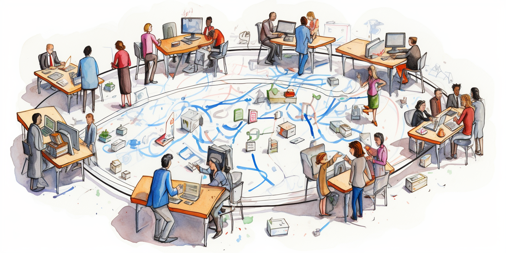

<h1>All Trust</h1>

<h2>Table of Contents</h2>

- [A Paradigm of Trust](#a-paradigm-of-trust)
- [Farmers: Investors in Shared Infrastructure](#farmers-investors-in-shared-infrastructure)
- [Grid Services: Facilitating System Usage](#grid-services-facilitating-system-usage)
- [Flexible Pricing Policies](#flexible-pricing-policies)
- [IOUs Enable Trusted Transactions](#ious-enable-trusted-transactions)
- [Guardian Circles: Humans Ensuring Oversight](#guardian-circles-humans-ensuring-oversight)
- [Summary](#summary)

***

## A Paradigm of Trust

What if instead of distrusting others, we embrace a paradigm of trust? The ThreeFold Grid 4.0 system is built on this principle of trust between all participants.

The TFGrid 4.0 comprises different actors, each represented by a 3bot digital assistant. 3bots enable automated interactions between farmers, service providers, and consumers.

## Farmers: Investors in Shared Infrastructure

- Farmers invest in hardware capacity like 3Nodes or Mycelium-based services (web gateways, 5G, etc). Their investments fund the grid infrastructure.
- Farmers can choose to actively manage their infrastructure using their 3bot. Or they can join a Farming Cooperative to simplify operations.  
- Either way, farmers earn profits when people purchase and utilize the infrastructure capacity they invested in. Their 3bots handle billing, monitoring, support issues, etc.

## Grid Services: Facilitating System Usage 

- Hundreds of different grid services can exist, from storage and compute to telecom and networking. 
- These services track usage metrics like bandwidth, storage consumption, RPC requests, etc. Usage data is reported transparently to the relevant farming 3bot.
- Consumers can interact directly with any service via the Mycelium message bus. Services deploy workloads, fulfill requests, provide monitoring, etc as needed.

## Flexible Pricing Policies 

- Farming 3bots define customized pricing policies for their services based on usage. Costs may vary based on compute time, storage quantities, bandwidth, etc.
- Pricing flexibility creates an open market. Farmers can price based on costs and desired profit margins. Consumers can shop for services based on performance, reliability, location, and price.

## IOUs Enable Trusted Transactions

- IOUs (I Owe You) represent agreements between farmers and consumers for grid usage. 
- Both parties digitally sign each IOU, ensuring consensus on the transaction details.
- At regular intervals, farmers submit IOUs to the Mycelium Pay Bridge operated by a Guardian Circle. This aggregates IOUs and requests payment from the consumer 3bots.
- Reputations are maintained on the blockchain to identify any bad actors abusing the system. But fundamentally, the system relies on trust between participants.

## Guardian Circles: Humans Ensuring Oversight

- We believe a Guardian Circle has the potential to be as good as blockchain and more because Guardian Circles still provide human oversight over key decisions when needed, the bulk of transactions run automated. 
- Circles enact decisions when their 9-99 member nodes reach consensus. They manage treasuries, set policies, enable collaboration between regional grids, and more.
- Their flexibility allows customization by each grid community based on local needs.
- Circles leverage tools like multisig wallets, Mycelium consensus, and VLang DSLs to codify logic while retaining human checks and balances.

## Summary

In summary, ThreeFold Grid 4.0 demonstrates that with the right incentives and oversight, we can build shared digital ecosystems founded on trust and collaboration.