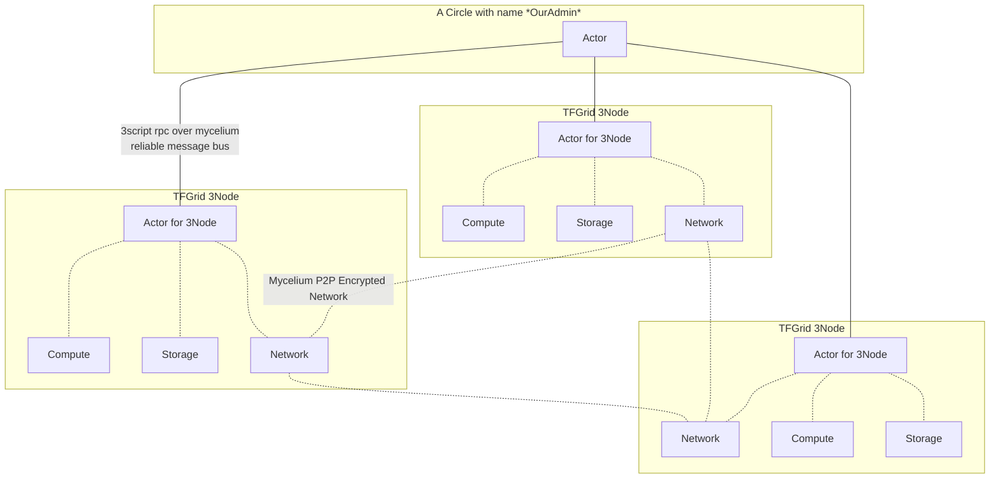
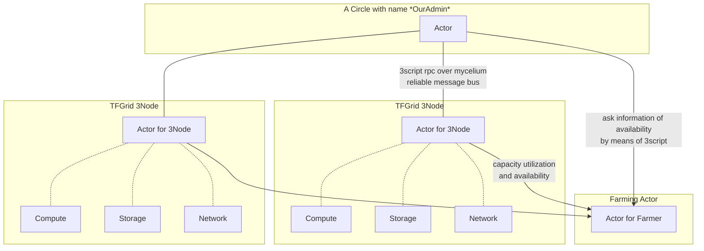

# TFGrid main actors

A Circle actor has the capability to communicate wiht 3Nodes, which are computers running on the TFGrid.

Each 3Node has an actor inside who has as function to manage the provisioning of compute, storage and network capacity.

The 3Node actor will report back to a farming actor (see below)

## farming actors

The Farming Actor will stor information of utilization & capacity in an internal DB (can be queried), so that every actor can find out how much capacity there is, is being used...

The farming actor will also do monitoring.