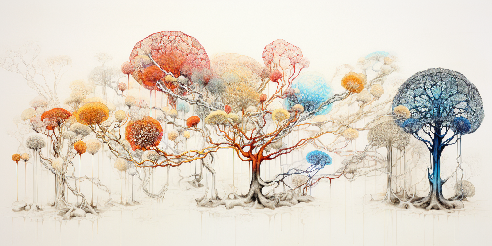
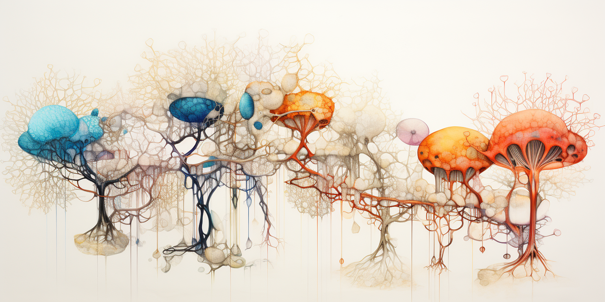
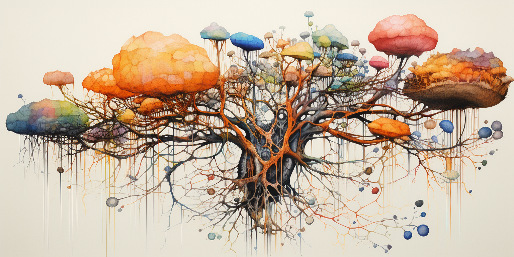

**THE OURWORLD VISION**

Our Modern Crisis:

* Centralized AI and data platforms lack transparency and accountability. 
This raises concerns about manipulating users or limiting their agency.

* Erosion of privacy and bodily autonomy through invasive surveillance and social credit systems. This endangers freedom of choice and expression.

* Environmental degradation that threatens sustainability of natural systems humanity depends on.

* Proliferation of misinformation that polarizes society. 
This impedes reasoned discourse and collective problem-solving.

These interconnected crises endanger the future – yet also present an opportunity for transformation. Business as usual will not suffice. Fundamental upgrades are needed across society.

Guiding Principles for Change (Planet and People First)

* **Consciousness -** Cultivate self-awareness, ethics and wisdom within each person.

* **Compassion -** Practice understanding, service and sharing. Choose collaboration over division. 

* **Sustainability -** Incentivize regeneration. Safeguard ecosystems for future generations. 

* **Autonomy **- Honor rights to self-determination and sovereignty. Prevent authoritarian overreach.

* **Meritocracy **- Structure governance to draw on diverse expertise while limiting corrupt influence.

* **Abundance - **Innovate systems that create shared prosperity through new economic models. 

Tools:

* **Decentralization -** Develop decentralized peer-to-peer networks for data, finance, communications, etc. This distributes power more equitably without centralized intermediaries.

* **Promote Education **that fosters critical thinking, self-awareness, and ethical values. This empowers individuals to make wise choices despite manipulative messaging.

* **Connect people** across divides to find common ground. This fosters societal cohesion and collective wisdom to address shared challenges.

* **Design economic models** that incentivize regeneration, compassion and creativity over self-interest. This creates abundance and reduces inequality.

* Champion **open collaboration** on solutions that benefit all of humanity and the planet. This unites us in shared purpose (opensource)

* **Support** individual and community rights to self-determination and bodily **sovereignty**. This prevents authoritarian overreach and protects freedoms.

Everyone has a role to play in this transformation. We must lift up humanity by elevating consciousness, enacting wise governance, developing ethical technologies, and coming together in good faith. The answers exist if we dare to dream widely and act boldly.

# OurWorld Venture Creator

OurWorld is a venture creator based in Mauritius who is finalizing its fundraise of 20-30 million EUR to empower our startups to manifest the required solutions aligned with our vision. 

These startups have access to Mycelium, a decentralized technology platform designed to enable conscious peer-to-peer collaboration. Mycelium provides the infrastructure for startups in the OurWorld ecosystem to develop transformative solutions, from finance to education. By combining funding, an ethical framework, and decentralized technologies, OurWorld aims to seed startups poised to make a positive societal impact. The versatile Mycelium platform allows this worldwide network of startups to exchange value and collectively upgrade how we cooperate.

# Mycelium: A Platform for Conscious Decentralization

Mycelium is a software platform designed to become smarter and more creative together and expand collective consciousness. Built on proven technologies, Mycelium allows peer-to-peer networks to flourish without centralized intermediaries.

Mycelium has no central point of control. The voluntary nodes forming the Mycelium network are operated by individuals and communities who share resources and capabilities to manifest a common vision. This structure aligns with principles of decentralization and autonomy.

Rich capabilities empower users to connect, communicate, transact and collaborate while retaining ownership of their own data and digital identities. Features like self-sovereign identity and encrypted communications enhance privacy and user agency.

Incentive structures reward conscious contributions that regenerate communities and the planet. The Mycelium ecosystem cultivates an ethos of compassion, sustainability and abundance.

With Mycelium, we can rebuild critical systems - from currency to culture - in a more decentralized, conscious manner. Mycelium provides the infrastructure for a digitally-connected society aligned with our highest values. 

**A worldwide web of compassion is within reach if we take up the challenge.**

#  

# What will you be able to do in first version of Mycelium

The first version of Mycelium enables makers and creators to build their own decentralized internet, inviting friends into the new digital worlds they imagine.

### Host your website, blog, wiki … 100% decentralized

With no single point of failure, your website can scale seamlessly. Reach a vast audience directly, with no intermediaries. Monetizing content is as easy as writing a page. Mycelium makes publishing open, resilient, and profitable - connecting your ideas to your community like never before.

### Reserve your unique name, Manage your Identity and Reputation.

Each website is hosted under a unique name you chose. This name is yours forever, be fast to claim your space on our new Internet. All funds received from paying for name services are used to develop mycelium further by means of a quadratic funding pool (see gitcoin).

Identity and Reputation are maybe your most 2 valuable assets on our new Internet. We take authenticity and reputation very seriously and it forms the base of any other feature.

### Become smarter together.

Feed diverse knowledge into your co-owned AI - from life experiences to company data. Together, become smarter than any centralized system. Pool knowledge within trusted circles to train AIs that understand your needs. Guide them with your values. Mycelium lets communities control their AI destinies, unlocking collective intelligence. Your data stays yours, but knowledge is created together in all authenticity.

### Communicate Globally over Shortest Path Possible in all Privacy

Any device, service or person gets connected over our mycelium network, the shortest path will always be chosen, all traffic is end2end encrypted and cannot be intercepted. If a network connection goes down you are automatically re-routed over networks of your community. You receive rewards for being a provider of network capacity.

You can send files or messages to any of your friends or business partners, the messages will be delivered ultra reliable using the shortest path. You can never lose any drop of communication nor be intercepted.

### Be your own youtube.

You want to share a lot of video or audio content, you don’t like to be a product of youtube, why not be your own youtube. Our youtube has built in content delivery capabilities with caching (you can reach millions of users). You can also monetize your content using Fungi Pay. 

We pre-populate this video peer2peer network with 3000 well chosen educational videos (see Sikana) which can now be watched for the next 4 billion times but now faster and fully decentralized.

### Collaborate with your Circles.

Mycelium Circles provide the infrastructure to mobilize collective intelligence for the greater good.

With Mycelium, users can self-organize into groups called Circles. You bring together whoever you need to achieve a shared purpose. Circles allow fluid, peer-to-peer teamwork aligned with your values.

Circles provide versatile features to align efforts and accelerate results. Define milestones, allocate resources, implement Agile workflows, and track progress in integrated systems. Shared ownership of goals and outcomes fosters co-creation.

For initiatives needing funding, Circles can hold a collective treasury with clear rules for utilization. This enables grassroots initiatives while limiting centralized control of assets.

Circles also facilitate society-wide cooperation across organizations. With bridges between Circles, aligned groups can come together in common cause - from regenerating ecosystems to providing universal healthcare.

### Manage and share your own data, manage your own time.

Manage your contacts, agenda, files, … Share your data with who you want.
Allow app developers to connect to you and fetch your information but on your terms.

Your data can never be lost nor corrupted. 

### For the techies: deploy your own Virtual Datacenter or AI System

Techies can deploy Linux or AI apps in the Mycelium Cloud, while still connecting to the traditional internet. This allows building next-generation solutions leveraging all Mycelium's benefits but being compatible with the current web2 and web3 world.

### For the developers: Create Advanced true P2P Apps with batteries included.

Developers can build purpose-driven applications on top of Mycelium's decentralized infrastructure. Leveraging components like the reliable message bus, distributed storage, vector db, and AI workers

You can even leverate Fungi Pay and Bridges to the existing banking system.

# 

# Our Technical Platform

### Mycelium Network Agent

A smart agent which runs on mobile phones, desktop and servers. All agents together create the Mycelium Network which might be the most reliable and secure internet network ever created.

The Network agent also provides other network services like name services, p2p database, reputation mgmt, micro payments, reliable message bus,  … 

All network traffic is end2end encrypted and can survive internet network outages. Hackers cannot intercept traffic or modify any information. The shortest path is always chosen between 2 participants in a communication flow (not based on algorithmic properties but based on latency and quality of network).

### Mycelium Cloud

Another name for our newest generation of the ThreeFold Cloud, the ability to host any linux, blockchain or AI workload on a global scale as long as we have enough motivated farmers to provide capacity. Farmers get rewarded for providing network, compute and storage capacity.

### Mycelium AI

A network of GPU’s which can be used by developers in the most flexible way using micropayments, avoiding large capex requirements. Our Aim is to enable the largest AI Network in the world for emerging countries. Micropayments are used to reward the providers of the GPU’s as well as Vector DB’s.

### Mycelium Search

AI based search, accessible by all participants and hosted by all participants in such a way we can index our new Internet. Is using opensource AI Models and large distributed vector databases. 

### Mycelium Circles

Collaboration tool written in Vlang, output is a nicely formatted ebook which dynamically gets regenerated depending on business model, crm data, cash flow, milestones, necessary requirements, tasks, … 

This is a revolutionary tool to be the base for our future collaboration.

### Fungi Stor

Different storage and database tools are required for any app to come alive, 

* Fungi VECTOR: needed for AI Applications

* Fungi STOR (Storage)

* Fungi STREAM (video, audio)

* Fungi FS (FileSystem)  (Q2 2024)

* Fungi SQL (H2 2024)

All of these storage applications work in full decentralized peer2peer way on top of the Mycelium Cloud and Network.

### Fungi Pay

None of the above can be done without a micropayment solution. 

Fungi Pay allows consumers of any network, compute, storage or any other cloud service to pay super small fees without latency and complications. Fungi Pay is based on IOU’s

These IOU’s are called Spores or in short SPRS , 1 SPR is a unit of exchange of value. You can exchange anything for anything else everywhere.

### Fungi Bridge

IOU’s need to be rolled up and be transformed to money transactions on blockchain or classic banking systems. Fungi Bridge takes care of this function and works from out of a sovereign digital freezone.

### MyTwin (Mycelium or My Twin)

Each Person owns a MyTwin, which is your avatar acting on your behalf on the Mycelium Network. Your MyTwin (MT) is the only digital creator who has the capability to reconstruct and manage your private data.

### VLang

Our own fast compiled safe development language.

### 3Node

ThreeFold Nodes also called 3Nodes are perfect hosts for the Mycelium Ecosystem, each of the above components can be hosted on 3Nodes.

In v4 of ThreeFold, farmers receive SPRS in exchange to TFT by means of a Fungi Bridge.

### OurPhone

Eventually we need our own phone, fully integrated and ready to go to unlock this ecosystem.

# 

# ROADMAP

Still very rough… 

## V1.0 = minimal viable product for the early adopter

End Q1 2023 should be possible if we can focus on creation and get in expansion mode. AI will still be somewhat basic. In parallel we need to grow our community in farmers to be ready for expansion.

## V1.1 = more user friendly interaction

* Super power full conversational UI for our digital life

* Nice web UI (or native for mobile)

* Much more powerful AI features

* First version of ourphone

## V1.2 = advanced features

* Metaverse (Augmented reality, …) using our own p2p gaming engine based on vlang.

# FAQ

## Is this a blockchain or crypto project

NO, we are compatible with many blockchains but we don’t rely on them. We believe peer2peer and consensus driven decision systems with bridges to other blockchains are more powerful and way more scalable, secure and efficient.

## Is this realistic?

We have been working on this for many many years over different of our own startups. We believe we have the pieces developed and ready to be integrated to a productized solution which can be used by many.

ThreeFold.IO can be seen as our 3e generation implementation of a peer2peer cloud.

We are very proud of our team and grateful for the constant out of box thinking.

## When will we have it?

Within 6 months is realistic, we are finalizing our next funding round and then we can go fast.

## How does Mycelium compare to?

* Urbit: a truly amazing project, many similar ideals and goals, we hope to be easier for people to start with and also be production quality faster.

* Holochain: a very nice project, focussed on personal data pods as well, with intelligent decentralized peer2peer compute. Longer history than us. Good community. 

Maybe rather than compete we can even work together?

Some of the problems we have tackled we have literally been trying to solve now for more than 30 years, we believe we are getting close, let's together try to break it, so we can fix it.

