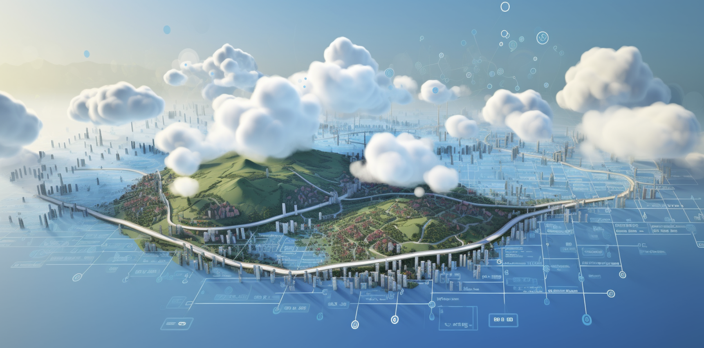

#  ThreeFold Cloud. 

The digital landscape is ready for a transformative cloud solution. Presently, dominant cloud platforms like Google, Amazon, and Microsoft are centralized. Yet, a significant portion of the global population remains underserved, lacking robust internet access and proximate data and computing resources.

Enter ThreeFold. Over the past five years, we've been pioneering technology that facilitates the global distribution of compute, storage, and network capacity. While our current reach might not rival giants like Google, the potential of our approach is groundbreaking. The ThreeFold Grid, our foundational infrastructure, operates on principles distinct from conventional cloud giants.

The uniqueness of the ThreeFold Grid lies in its decentralized ownership. Numerous individuals and companies worldwide contribute hardware to the collective, enhancing global access to storage, compute, and network resources. These contributors, known as ThreeFold farmers, receive ThreeFold Tokens as rewards for both providing this capacity and also earn additional rewards when the capacity is utilized.

Based in Dubai, ThreeFold Cloud is now delivering services on top of this grid. Yet, it ensures that every user retains complete control and access to their deployed workloads.

### ThreeFold DMCC: The Driving Force Behind ThreeFold Cloud

ThreeFold Cloud operates under the umbrella of ThreeFold DMCC, a company based in one of the best regulated economic free zones in Dubai. This strategic positioning allows us to tap into the dynamic and innovative environment of the region, fostering growth and expansion of the ThreeFold grid.

ThreeFold DMCC is not just our corporate identity; it's the hub from which we manage and operate essential community tools. This includes platforms like our dedicated forum, where users, developers, and enthusiasts can engage in meaningful discussions, share insights, and collaborate on projects. Additionally, our websites, which serve as the primary interface for our audience to learn about and interact with our offerings, are also managed from this central point.

ThreeFold DMCC is the organizational backbone, ensuring smooth operations, community engagement, and the continuous scaling of the ThreeFold grid.

### ThreeFold Cloud's Expansion and Fundraising Initiative

Recognizing the need to enhance our capabilities and streamline the rollout of new services, our immediate focus is on expanding our team. By bolstering our human resources, we aim to ensure efficient development, deployment, and support for our upcoming offerings.

To facilitate this growth, we are currently in the midst of a fundraising campaign. Our projections are optimistic, and we anticipate securing the necessary funds within the next three months. Once achieved, these funds will be instrumental in launching the new services that our team is diligently working on.

Furthermore, this expansion is not just about introducing new services. It also encompasses a strategic upgrade to the ThreeFold grid. This upgrade is particularly significant for our community of farmers. We're transitioning to a revamped tokenomics model, designed to address and rectify challenges faced with the existing model.

In essence, this period marks a transformative phase for ThreeFold Cloud. With a combination of fundraising, team expansion, and system upgrades, we're setting the stage for a more robust, efficient, and rewarding cloud ecosystem for all our stakeholders.

