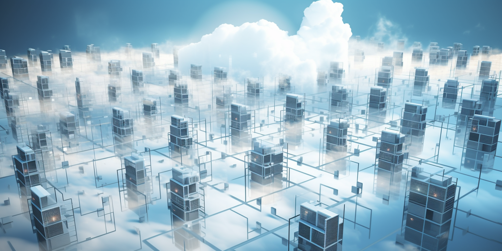
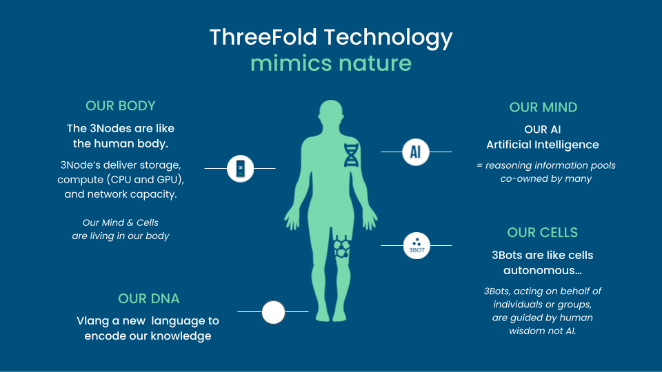
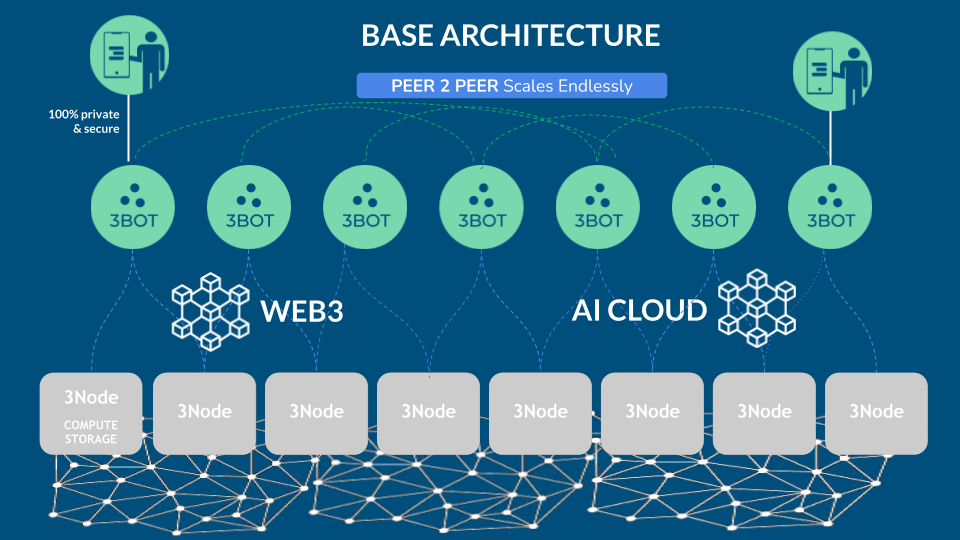
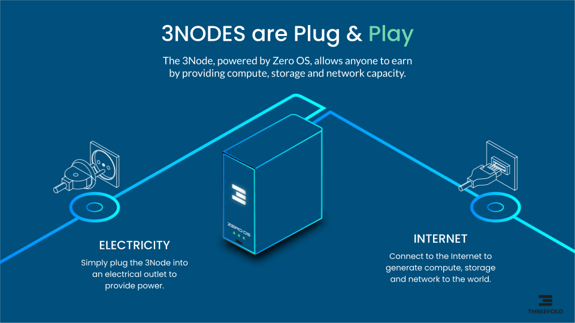
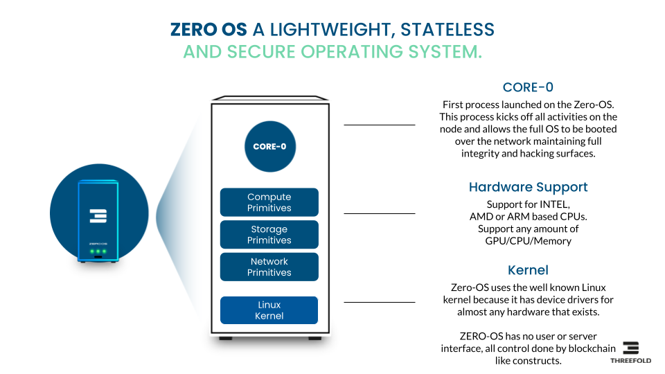
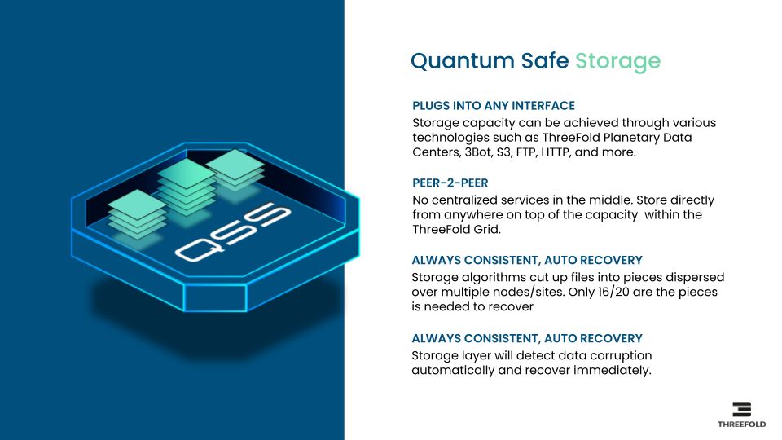

# Autonomous Safe Cloud and AI Platform 

Imagine a world where everyone is empowered to deploy any Blockchain, Cloud or AI workloads with self-healing and Autonomous capabilities. This system would dynamically allocate or deallocate CPU’s and GPUs based on computational needs. The Autonomous System would recover from unforeseen scenarios, restoring operational efficiency and adhering to redundancy requirements to ensure continuous and reliable performance.

This entire process runs without compromising security. The system isn't managed by the AI itself, but by separate circuits tied to a collective of human stakeholders (we call this a Human Chain). These stakeholders retain control over the operation at all times. It could be that a consensus among these stakeholders is necessary before executing specific change requests, serving as a measure for enhanced security. This is ensured through the deployment of two independent, unconnected circuits. The first is the AI circuit, essentially your AI application, which can harness thousands of GPUs and process vast amounts of information. Concurrently, there's the Control Circuit, which is governed by Human Chains, keeping human oversight integral to the system's operation. 

The AI Circuit doesn't have access to the Control Circuit. Any modification in the Control Circuit requires consensus before implementation, and our foolproof system ensures that all changes are deployed in strict accordance with the intended state (we call this a Tamper Proof deployment). This process guarantees a 100% match between the actual deployment and the originally planned modifications.

The integrity of our Control Circuit is safeguarded from potential threats such as other AI systems, quantum computers, or cyber attackers. This security is due to our adoption of consensus-based principles analogous to those utilized in modern blockchain technologies.

We believe that no other company approaches this level of capability. In our opinion, the creation of a true autonomous AI system is not possible without an operating system such as our Zero-OS.

Above described system is not a dream but is close to being reality in our version 4.0 of our software stack.

# ThreeFold Mimics Nature

Today's IT systems are too complicated and layered, causing a whole heap of problems like using too much electricity, making life hard for developers, not using computer resources in the best way, and creating security, privacy, scalability, and performance issues. 

But there's good news: ThreeFold is hard at work building an autonomous generic usable IT platform. This platform is designed to offer everything needed to make the back-end of the Internet, AI, and Blockchain work better.

At ThreeFold we like to look at nature and learn from it, this is also called Biomimicry. Biomimicry is a design discipline that seeks to solve human problems by emulating nature's time-tested patterns and strategies. The core idea is that nature, with 3.8 billion years of evolution and adaptation, has already solved many of the problems we are grappling with. Animals, plants, and microbes are the consummate engineers and designers.

3Bots represent humans and work together in consensus to control any IT workload. They utilize the capacity of 3Nodes in such a way to maximize reliability, uptime, security, and privacy. The 3Bots facilitate users' access to the extensive knowledge encapsulated within the AI Cloud. This AI Cloud can be trained with contributions from thousands of individuals. Additionally, developers are relieved of the overwhelming complexity prevalent in today's systems.

The current ThreeFold opensource platform is generation 3 and expanding every day, see [https://dashboard.grid.tf/explorer/statistics](img/https://dashboard.grid.tf/explorer/statistics) . 

ThreeFold is now ready to deliver customized private versions of this platform for any use case which requires more efficiency, manageability, scalability and security.

# Unlimited Scalable & Flexible

Millions of 3Nodes can empower the capacity layer, billions of 3Bots can be the Autonomous Agents managing any of the workloads in the network. Each 3Bot is owned by one person. The 3Bots can operate Autonomous Circles which are driven by Human Chains.

The connection between the 3Bot and the owner is secure and private. All 3Bots are identified through a blockchain and reputation is an important concept to make sure our network is as safe as possible.

AI Clouds are networks of AI capacity owned by Autonomous Circles. We believe in a world where there will not be one huge AI but many AI’s owned by different groups of people.

The 3Bots can operate and communicate with any Web3 based technology. This provides for ultimate flexibility and allows Autonomous Circles or 3Bots to deal with smart contracts and digital currencies.

# COMPONENTS

## 3Node and Zero-OS

Zero-OS is our uniquely designed stateless Operating System which is efficient and optimized for autonomous operation. The Zero-OS uses blockchain technology to allow people by means of their 3Bots deploy IT workloads with more security and using less electricity. Zero-OS cannot be used by people directly, it's an operating system close to the hardware and designed to deliver the features as described below.

A 3Node is a computer running the Zero-OS. 3Nodes are interconnected to together create an AI Cloud. An overlay secure private network is used to make sure IT workloads can communicate fast and privately.

## AI CLOUD

Capable of scaling up to millions of GPUs and thousands of independent but optionally interconnected clouds, each AI Cloud is equipped with its own blockchain used for tracking of farming (mining) and utilization/billing of the Cloud. The AI Clouds can be interconnected or deployed in a complete private context. The AI clouds are managed by consensus driven 3Bots.

## 3BOT

3Bots are owned by people. Each 3Bot represents one person, they can together manage complicated IT workloads. People can define Autonomous Circles which represent topics of interest e.g. deployment of an AI system. Each project can be co-owned by more than one 3Bot (person).

A 3Bot has the knowledge required to deploy, manage and operate IT workloads like AI, Blockchain or others. A 3Bot knows how to self heal and rebalance resources as required to optimize performance, energy usage and uptime. 

## AUTONOMOUS & CONSENSUS DRIVEN

### Autonomous Circle

An Autonomous Circle is like a project which holds all required information, resources and knowledge required to operationally manage an IT environment. An example could be an AI based Application or a Private Blockchain.

An Autonomous Circle is owned by one or more 3Bots. A consensus criteria can be defined which means that important changes in the project need consensus of the stakeholders. The co-owners of an Autonomous Circle can create an optional treasury of financial assets (money). The co-owners together own the treasury, the treasury can be used to reward the members of the circles for contribution or pay for the resources as used in the AI Cloud.

Autonomous Circles are kept healthy thanks to the knowledge as owned by the 3Bots. The 3Bots will monitor and act if issues arise, this produces consensus driven management for cloud applications.

### Human Chain

The Human Chain concept is important to deliver a "safe" Autonomous AI System. A Human Chain functions similarly to a blockchain but rather than relying on a smart contract to execute a consensus mechanism, it ensures human stakeholders maintain complete visibility into the operation and modification requests. Humans have total awareness of all ongoing activities and, as a collective, can effect changes in the deployment upon reaching a consensus.

A Human Chain is the combination of a certain number of 3Bots co-owning an Autonomous Circle. The Co-owners of such a project own the Human Chain and validate all transactions as executed on behalf of the Autonomous Circle. If consensus cannot be reached, the required transactions will not be accepted by the rest of the ecosystem. A Human Chain can also secure a treasury of money.

While we don't foresee AI becoming conscious and posing a global threat in the near future, we do acknowledge that AI systems are potent tools. These tools can be misused by hackers, or errors can occur, leading to serious consequences, this is where a Human Chain can help.

# SOME OF THE BENEFITS

## Deterministic Deployments

The system is able to build the required software (e.g. AI Application) in a secure and deterministic way. The build systems are run autonomously but still controlled by a Human Chain.

Once consensus achieved, builds verified they will be deployed using our Tamper Proof system which makes sure that the build will always correspond to the reality. No hacker or alternative system will be able to influence how applications get deployed on the AI Grid.

## Private AI

The concept of Private AI facilitates safer and more confidential data processing by AI systems. It enables the processing of vast amounts of data in such a manner that human access is either eliminated or, if necessary, granted in a highly controlled way through blockchain mechanisms.

Take the instance of security camera footage processing. The challenge lies in allowing AI to handle all the processing while ensuring that the same information remains inaccessible to hackers or compromised security personnel.

## Edge AI

Occasionally, it's more practical to transport the AI application to the data's location instead of vice versa. For instance, consider security cameras and AI image processing. Picture the ability to deploy a new AI application across thousands of cameras simultaneously in just a minute, delivering insights more quickly and securely. New approaches are required to realize this potential.

## Rapid Start

Deploy your AI workload much faster without having to copy as much data. Certain AI workloads can be sizable (many Gigabytes), it can take a long time for these workloads to be deployed especially if AI will be used in an Edge AI Context. Systems which otherwise would take 30 min to be deployed we can do in less than 1 minute.

## Tamper Proof

Deploy your AI workloads in such a way that no-one can modify the intended result. Even if only as much as 1 bit would be changed between time of build and deployment Zero-OS will refuse to start the application.

## Quantum Safe Storage 

Our QSS allows data to be stored in such a way that data can never be lost nor corrupted. Not even a quantum computer can get access to the information.

# THE ROLE OF QUANTUM SAFE STORAGE FOR AI

Imagine a storage system with the following benefits:

* up to 10x more efficient (power and usage of hardware) for certain workloads
* ultra reliable, data can not be lost
* ultra safe & private
* ultra scalable
* sovereign, data is close to you in the country of your choice
* true Peer To Peer, by everyone for everyone.
* not even a quantum computer can hack the storage

It is not a dream, it does already exist.

Our storage architecture follows a true distributed design. Participating nodes (can be on ultra safe locations) only store small incomplete parts of data (files, photos, movies, databases…) by only offering a slice of their current (local) storage devices. Managing the storage and retrieval of all these ‘distributed fragments’ is done by a software that creates ‘development and/or end-user interfaces’ for this storage algorithm. We call this ‘dispersed storage‘.

The user has complete control over where the data is stored and which level of redundancy which is required.

A storage system like this is very useful for an AI system, large datasets can be ingested or large language models loaded more quickly. We can even thin provision these language models to be even more efficient.

