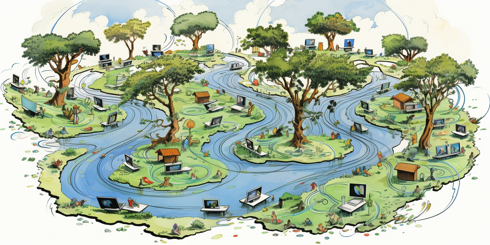

The opensource grid is an opensource movement, TFTech an TFCloud are 2 sponsors of this project.

# TFCloud

- The Company who is behind this e-book
- TFCloud is called ThreeFold DMCC and is based in Dubai.
- TFCloud delivers commercial hosting solutions on top of the grid.
- TFCloud products will go life Q1 2024 (beta already in dec 2023)
- TFCloud best effort maintains the threefold forum and delivers best effort support for the TFGrid as well.
- TFCloud is not a crypto company and has no interest to support speculation or any other financial game around the tokens, TFCloud is all about leveraging a distributed network of compute & storage capacity for its own solutions.

# TFTech

- codes most of the opensource software as used in the TFGrid
- contributes all this code 
- support is best effort
- TFTech sells commercial licenses to help companies, governments and enterprises to make most out of the code.
- TFTech also does OEM deals with partners for specific usecases.

# **Promise to 100% independence of TFGrid**

- TFCloud and TFGrid are motivated to let the TFGrid infrastructure run independenty from TFTech and TFCloud by mid to end 2024.
- Run Independently means
   - less than 20% of the validators or other tech components should be managed by TFTech or TFCloud
   - less than 20% of the guardians are linked to  TFTech or TFCloud
   - guardians will have to decide on upgrades of 3nodes linked to their regional internet
- Anyone community in the world can run their own regional Internet without any help of TFCloud/TFTech.
- This basically means if TFTech and TFCloud would no longer exist and community has interest to keep on funding the project, then the project can continue by itself. 

> said differently the ThreeFold Grid Baby became and adult and moved out of the house.

# OpenSource TFGrid

- [TFGrid 4.0](tfcloud/tfgrid/v40/40.md)
- [All Trust](tfcloud/tfgrid/v40/alltrust.md)
- [Decentralization](tfcloud/tfgrid/decentralization.md)
- [Guardians](tfcloud/tfgrid/v40/guardian.md)
- [Tokenomics](tfcloud/tfgrid/tokenomics_tfgrid.md)
- [Roadmap](tfcloud/tfgrid/roadmap_tfgrid.md)